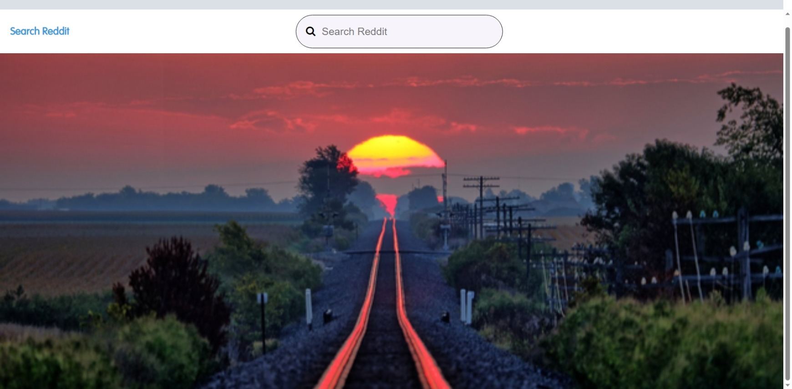
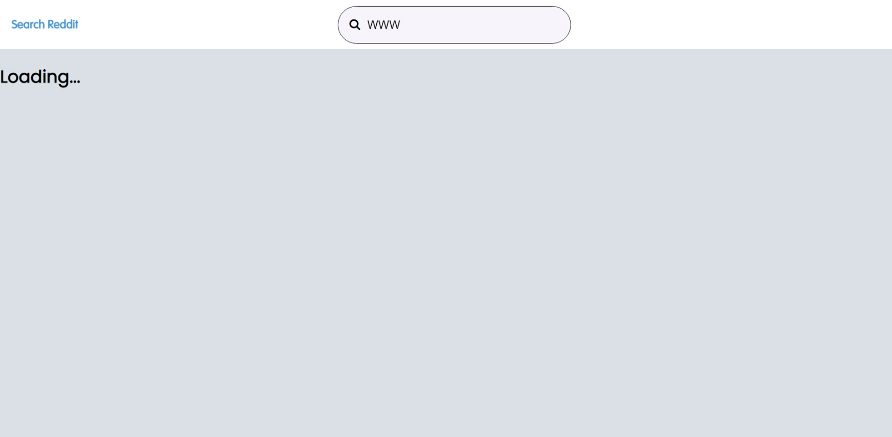

# 1. Introduction

This project is a UI version of [Reddit](https://www.reddit.com) search feature.

The following section demonstrates some of the key visual of this project.

## 1.1 Home page.

This is how the Home page would look similar to this.

The background image below the navbar will change randomly to one of the images in the [images](src/RedditMirror/data/images/) folder whenever an user refresh the home page. 

## 1.2 Loading page.

This project call a reddit API to get data from reddit. While the page is waiting for the return result, a loading page will show up as below. 

## 1.3 Result page.

